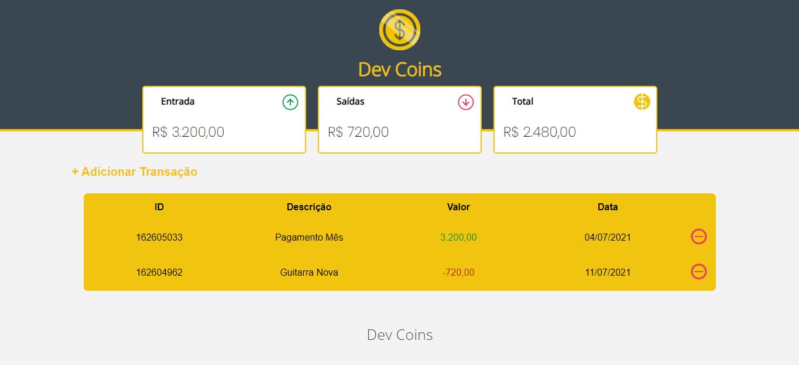
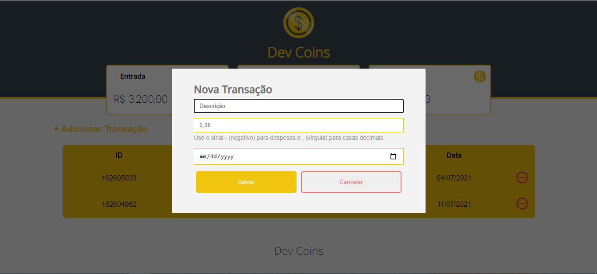
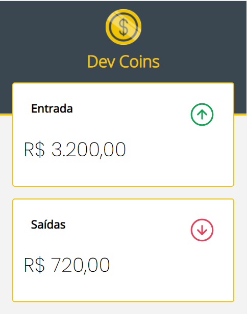

# Dev-Coins

Uma aplicação que faz uso da técnica Pomodoro que é um método de gerenciamento de tempo e produtividade

<h3>Recursos</h3>
  <ul>
    <li>Persistência de Dados no Storage</li>
    <li>Modal para adicionar as transações</li>
    <li>Display de valores de "Entrada", "Saida" e "Total"</li>
    <li>Geração de ID (Chave Primaria) de forma automática</li>
    <li>Tabela dinamica, contendo cada transação e seus respectivos dados</li>
    <li>Exclusão de transação</li>
    <li>Responsivo</li>
  </ul>
  
  <h3>Screenshot</h3>
    <h4 align="center">
      
    </h4>
    <h4 align="center">
      
    </h4>
    <h4 align="center">
      
    </h4>
